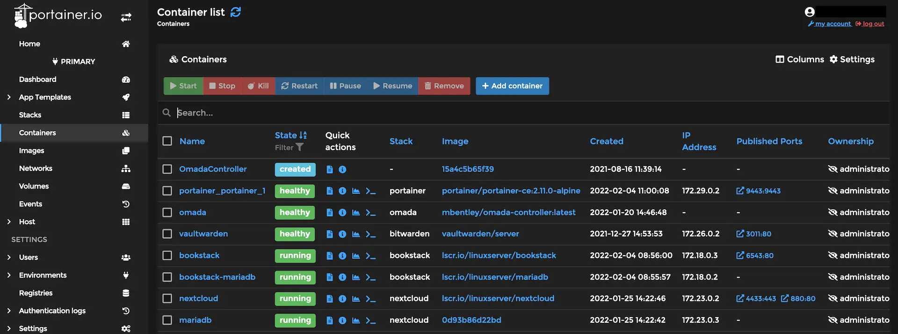

# Portainer Docker Management

<figure><figcaption></figcaption></figure>



#### Add a volume to Docker

```
sudo docker volume create portainer_data
```

When creating a new container it is always good to add a volume before, this goes for all containers you create in the future &#x20;

#### Quick-Start Docker

```
sudo docker run -d -p 8000:8000 -p 9443:9443 --name portainer --restart=always -v /var/run/docker.sock:/var/run/docker.sock -v portainer_data:/data portainer/portainer-ce:latest
```



#### Install docker Portainer and run a small docker through Portainer


