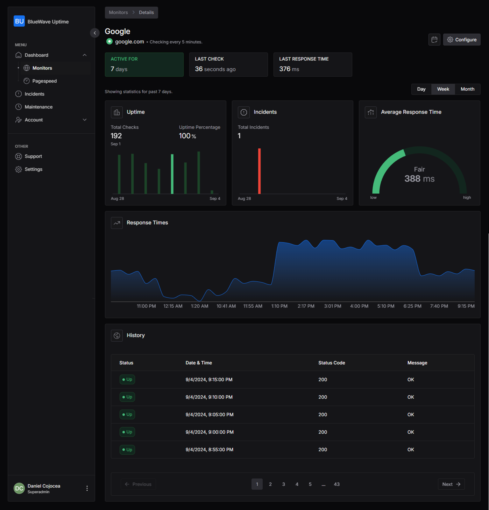

# BlueWave Uptime

**An open source server monitoring application**

BlueWave Uptime is an open source server monitoring application used to track the operational status and performance of servers and websites. It regularly checks whether a server/website is accessible and performs optimally, providing real-time alerts and reports on the monitored services' availability, downtime, and response time.

<figure><figcaption></figcaption></figure>


