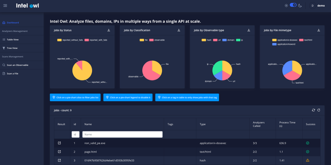

# IntelOwl threat-hunting platform

<figure><figcaption></figcaption></figure>

Do you want to get **threat intelligence data** about a malware, an IP address or a domain? Do you want to get this kind of data from multiple sources at the same time using **a single API request**?

You are in the right place!

IntelOwl is an Open Source solution for management of Threat Intelligence at scale. It integrates a number of analyzers available online and a lot of cutting-edge malware analysis tools.


