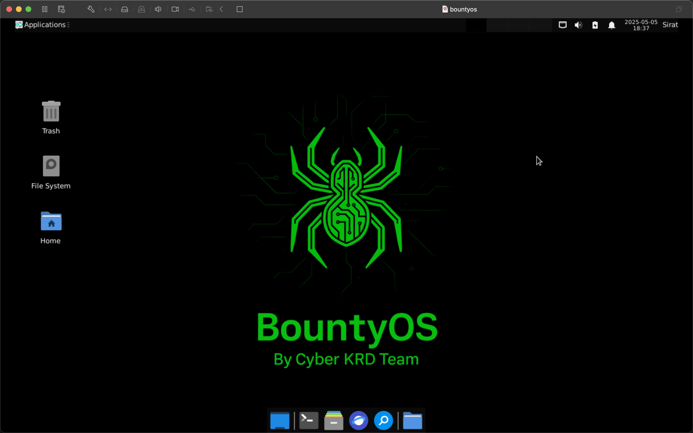

# BountyOS

<figure><figcaption></figcaption></figure>

BountyOS is a custom Debian 12-based Linux distro crafted exclusively for bug bounty professionals and real-world web app security research. Unlike traditional hacking distros packed with unnecessary tools, BountyOS stays clean, sharp, and purpose-driven.

* All tools work in Live Mode — no installation required.
* Installation is fast, easy, and optional.
* Powered by stable and secure Debian 12.
* Supports both `amd64` and `arm64` architectures.
* Architecture-specific tools — optimized for your system.
* No outdated or archived tools included.
* Ongoing updates and custom tools developed by us.
* Includes exclusive tools not found in other distros.
* Bug bounty hunters on platforms like HackerOne, Bugcrowd, Intigriti, YesWeHack
* Security researchers focusing on recon and app testing
* Red teamers who want a clean OS without bloat


