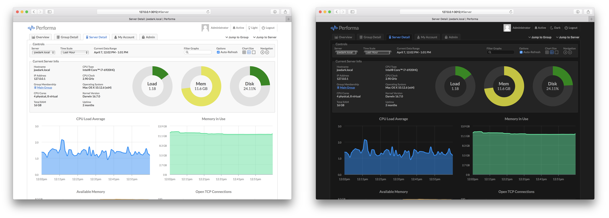

# Performa Network Monitoring

<figure><figcaption></figcaption></figure>

**Performa** is a multi-server monitoring system with a web based front-end UI. It can monitor CPU, memory, disk, network, and of course your own custom metrics. Alerts can be configured to trigger on any expression, and send e-mails or fire web hooks. Timeline data can be stored on local disk or in Amazon S3.


