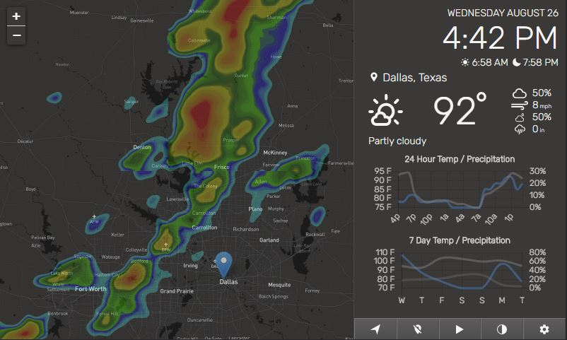

# Pi Weather Station

<figure><figcaption></figcaption></figure>

A server that Run a weather map and accessible from a web UI

The documentation is saying put on a raspberry pie but I used Ubuntu server with node installed

Out of the box it wont show up on your network but will if you remove "localhost"

```
app.listen(PORT, "localhost", async () => {
```

&#x20;So it will look like

```
app.listen(PORT, async () => {
```


