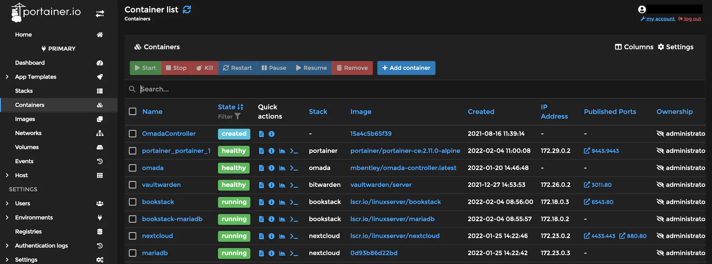

# Portainer Docker Management

<figure><figcaption></figcaption></figure>



Quick-Start Docker

`docker run -d -p 8000:8000 -p 9443:9443 --name portainer --restart=always -v /var/run/docker.sock:/var/run/docker.sock -v portainer_data:/data portainer/portainer-ce:latest`


