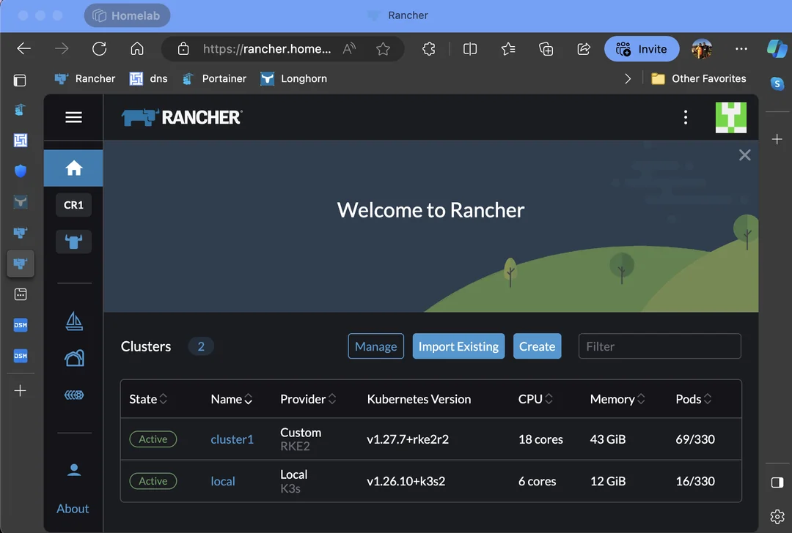

# Rancher Kubernetes cluster

<figure><figcaption></figcaption></figure>

Docker Quick-start

```
docker run -d --restart=unless-stopped \
  -p 80:80 -p 443:443 \
  --privileged \
  rancher/rancher:latest
```


