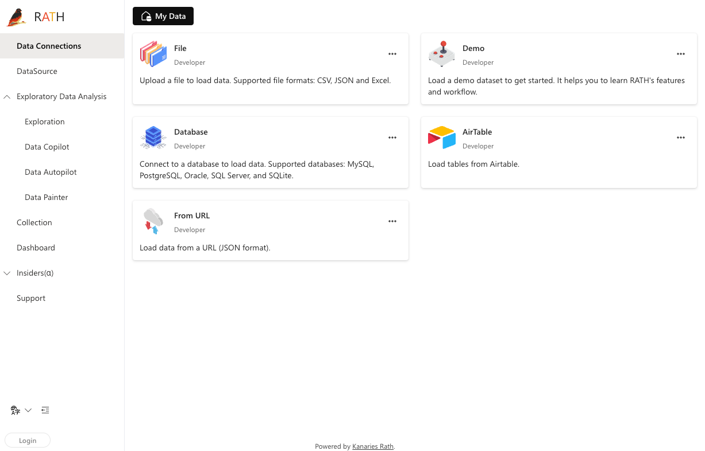
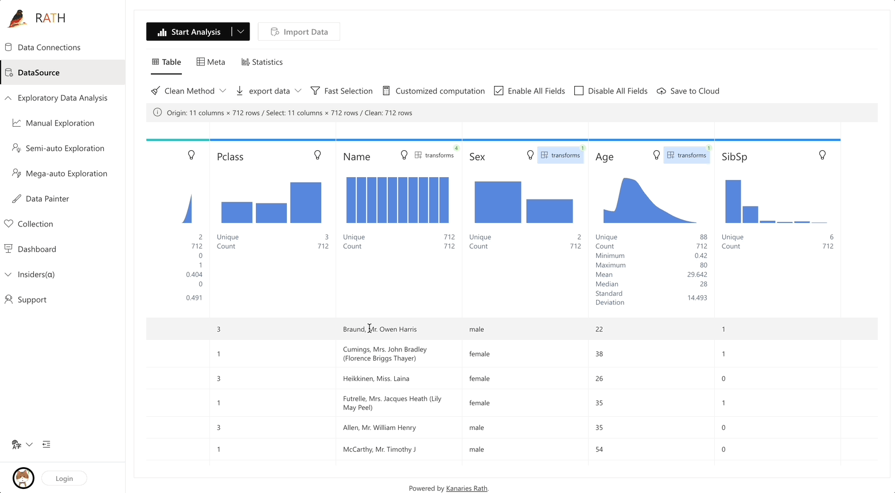

# Rath Data Analysis and Visualization tools

**RATH** is not just an open-source alternative to Data Analysis and Visualization tools such as Tableau, but it automates your Exploratory Data Analysis workflow with an Augmented Analytic engine by discovering patterns, insights, casuals and presents those insights with powerful auto-generated multi-dimensional data visualization.

<figure><figcaption></figcaption></figure>

<figure><figcaption></figcaption></figure>



#### Demo




