# SPL Breakdown

### Comparison Operators

<figure>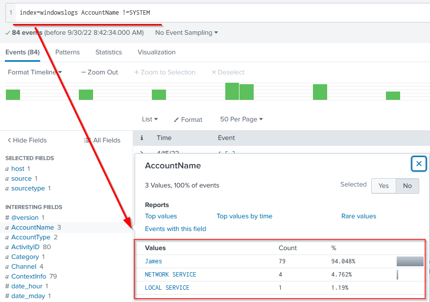<figcaption></figcaption></figure>

| 
Field Name 
               | 
Operator 
 | 
Example 
                  | 
Explanation 
                                                                                                                                                        |
| ----------------------------------- | ------------------- | ----------------------------------- | ----------------------------------------------------------------------------------------------------------------------------------------------------------------------------- |
| 
Equal 
                    | 
= 
        | UserName=Mark                       | 
This operator is used to match values against the field. In this example, it will look for all the events, where the value of the field UserName is equal to Mark. 
 |
| 
Not Equal to 
             | 
!= 
       | UserName!=Mark                      | 
This operator returns all the events where the UserName value does not match Mark. 
                                                                                 |
| 
Less than 
                | 
&#x3C; 
   | Age < 10                            | 
Showing all the events with the value of Age less than 10. 
                                                                                                         |
| 
Less than or Equal to 
    | 
&#x3C;= 
  | Age <= 10                           | Showing all the events with the value of Age less than or equal to 10.                                                                                                        |
| 
Greater than 
             | 
> 
        | 
Outbound_traffic > 50 MB 
 | 
This will return all the events where the Outbound traffic value is over 50 MB. 
                                                                                    |
| 
Greater Than or Equal to 
 | 
>= 
       | Outbound\_traffic >= 50 MB          | This will return all the events where the Outbound traffic value is greater or equal to 50 MB.                                                                                |

### Boolean Operators

<figure>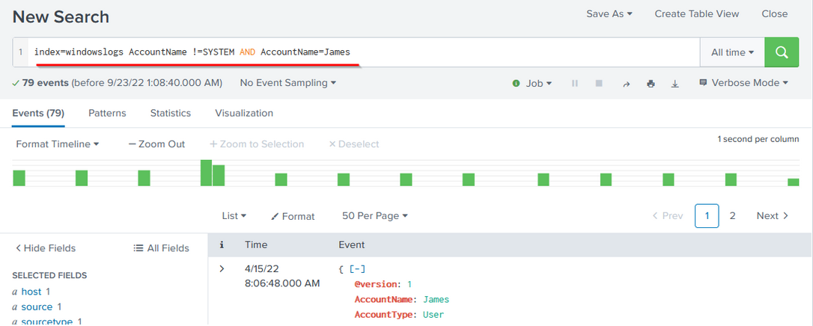<figcaption></figcaption></figure>

| 
Operator 
 | 
Syntax 
                           | 
Explanation 
                                                                  |
| ------------------- | ------------------------------------------- | --------------------------------------------------------------------------------------- |
| 
NOT 
      | 
field_A NOT value 
                | 
Ignore the events from the result where field_A contain the specified value. 
 |
| 
OR 
       | 
field_A=value1 OR field_A=value2 
 | 
Return all the events in which field_A contains either value1 or value2. 
     |
| 
AND 
      | field\_A=value1 AND field\_B=value2         | Return all the events in which field\_A contains value1 and field\_B contains value2.   |

### Wild Card

<figure>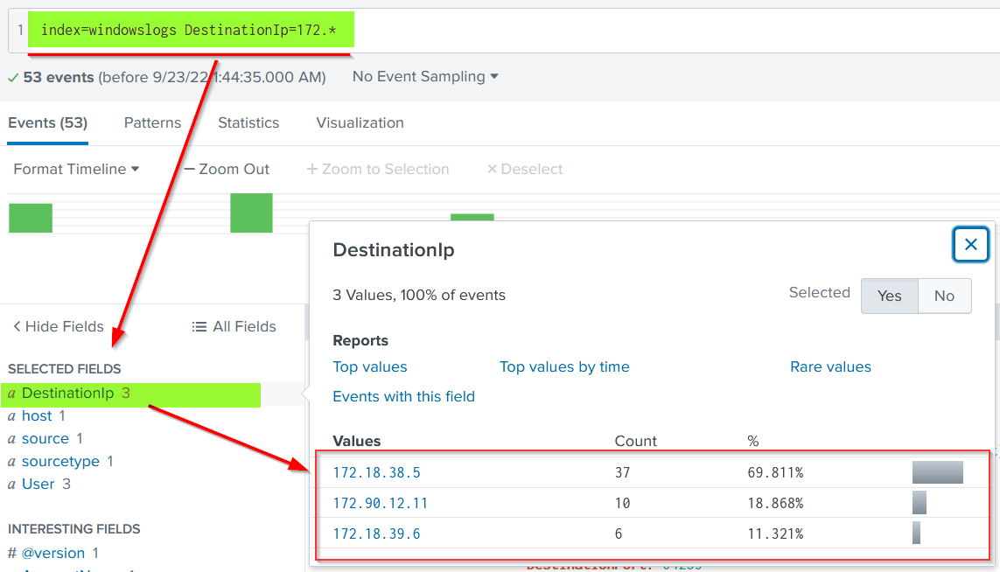<figcaption></figcaption></figure>

| Wildcard symbol  | 
Example    
 | 
Explanation          
                                                                 |
| ---------------- | --------------------- | ----------------------------------------------------------------------------------------------- |
| 
*  
 | status=fail\*         | 
It will return all the results with values like

status=failed

status=failure
 |

### Fields

<figure>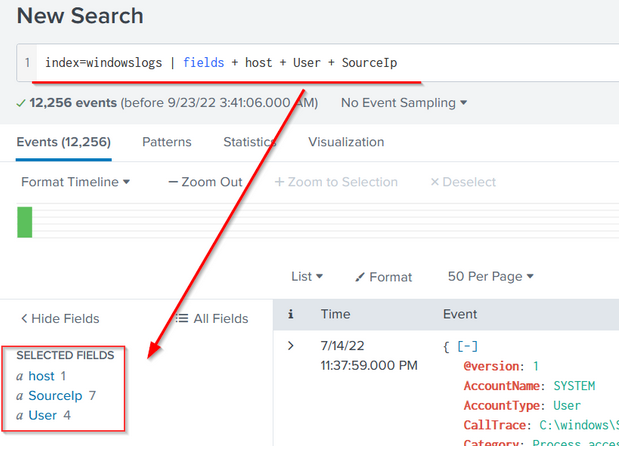<figcaption></figcaption></figure>

### Search

<figure>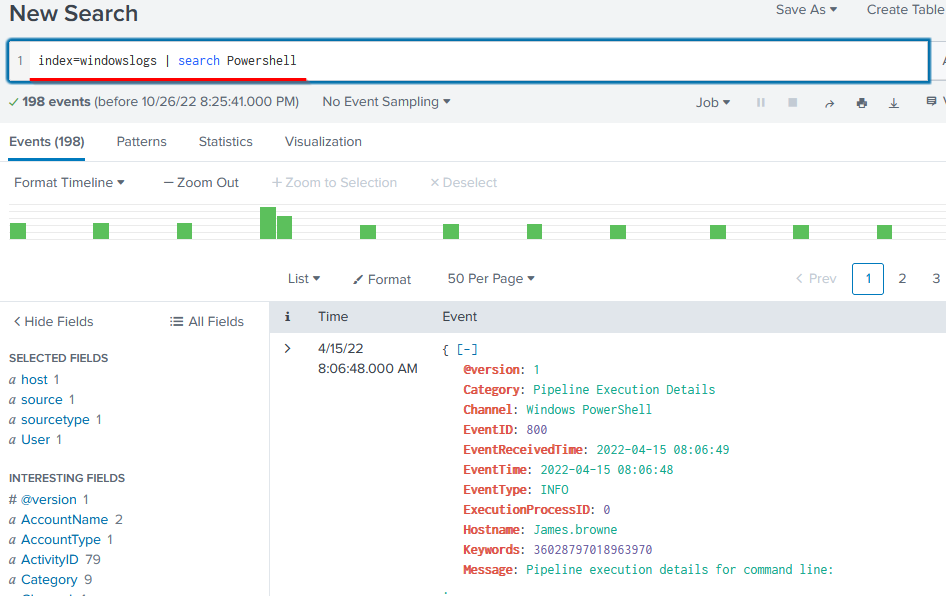<figcaption></figcaption></figure>

### Dedup

The command used to remove duplicate fields from the search results. We often get the results with various fields getting the same results. These commands remove the duplicates to show the unique values.

<figure>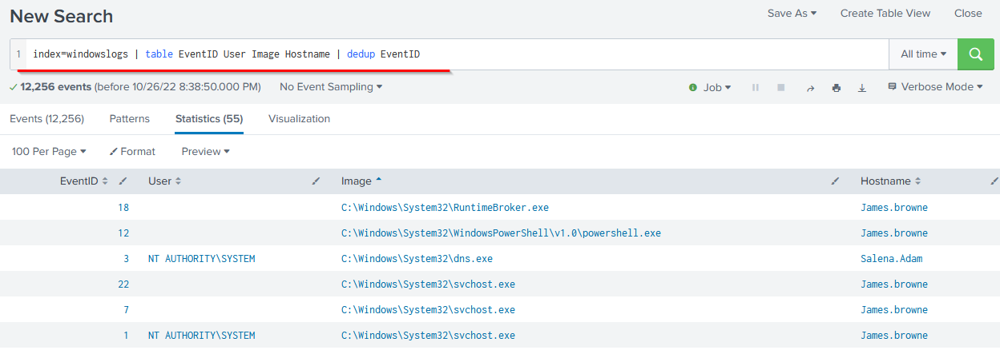<figcaption></figcaption></figure>

### Rename

<figure>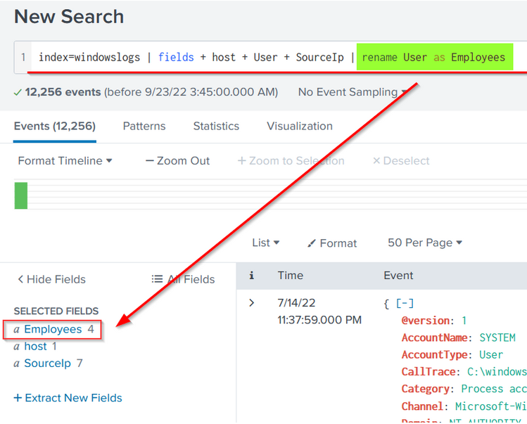<figcaption></figcaption></figure>

### Table

<figure>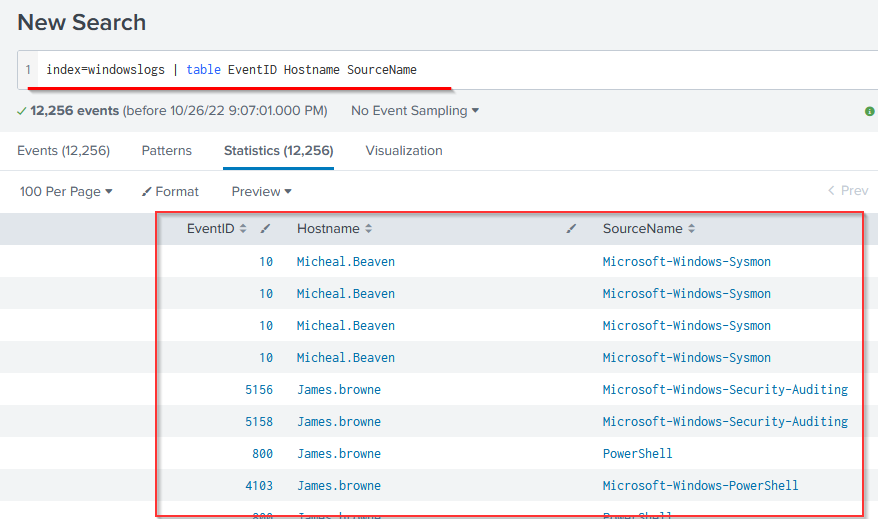<figcaption></figcaption></figure>

### Head

The head command returns the first 10 events if no number is specified.

<figure>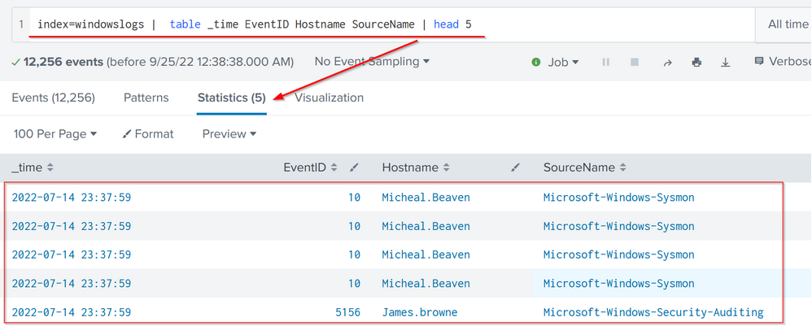<figcaption></figcaption></figure>

### Tail

The Tail command returns the last 10 events if no number is specified.

<figure>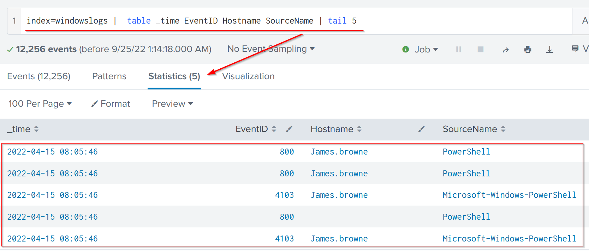<figcaption></figcaption></figure>

### Sort

<figure>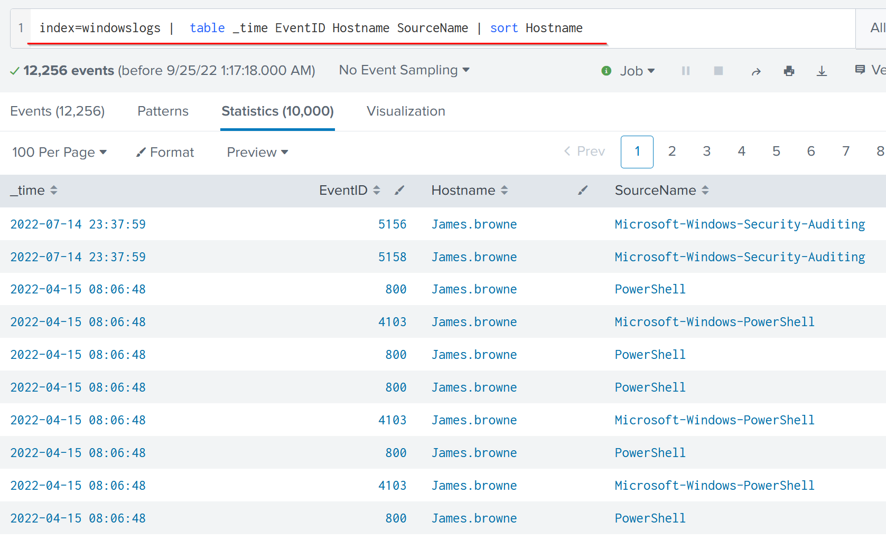<figcaption></figcaption></figure>

### Reverse

The reverse command simply reverses the order of the events.

<figure>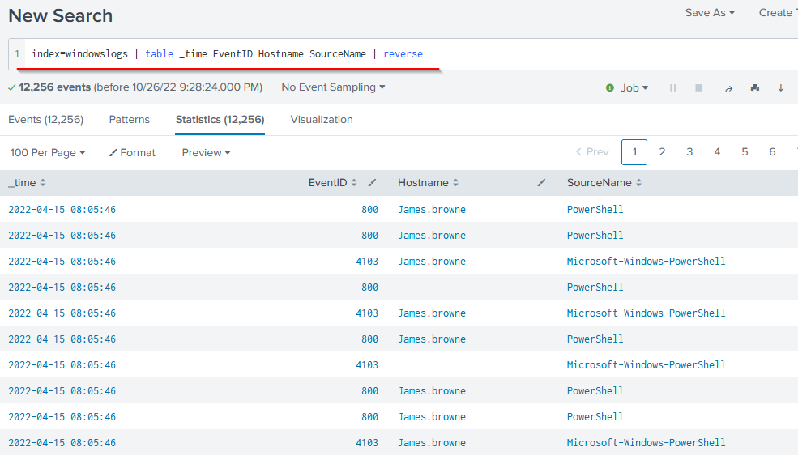<figcaption></figcaption></figure>

### Top

This command returns frequent values for the top 10 events.

<figure>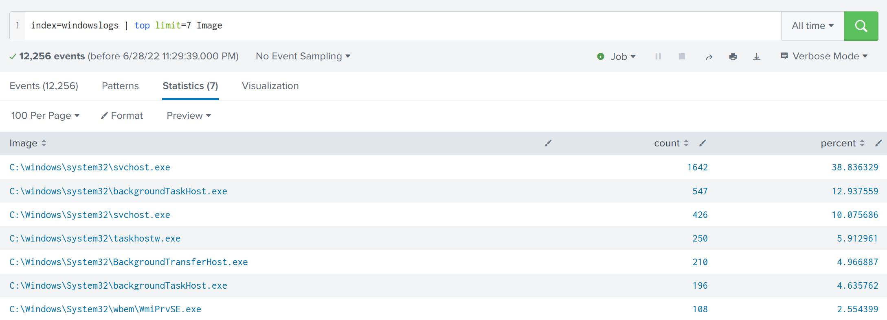<figcaption></figcaption></figure>

### Rare

This command does the opposite of top command as it returns the least frequent values or bottom 10 results.

<figure>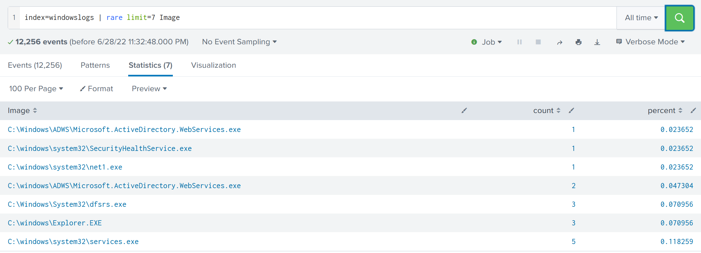<figcaption></figcaption></figure>

### Highlight

The highlight command shows the results in raw events mode with fields highlighted.

<figure><figcaption></figcaption></figure>

### Stats

| 
Command 
 | 
Explanation 
                                            | 
Syntax 
                  | 
Example 
                 |
| ------------------ | ----------------------------------------------------------------- | ---------------------------------- | ---------------------------------- |
| 
Average 
 | This command is used to calculate the average of the given field. | stats avg(field\_name)             | stats avg(product\_price)          |
| 
Max 
     | It will return the maximum value from the specific field.         | stats max(field\_name)             | stats max(user\_age)               |
| 
Min 
     | It will return the minimum value from the specific field.         | stats min(field\_name)             | stats min(product\_price)          |
| 
Sum 
     | It will return the sum of the fields in a specific value.         | stats sum(field\_name)             | 
stats sum(product_cost) 
 |
| 
Count 
   | The count command returns the number of data occurrences.         | stats count(function) AS new\_NAME | stats count(source\_IP)            |

### Chart

The chart command is used to transform the data into tables or visualizations.

<figure>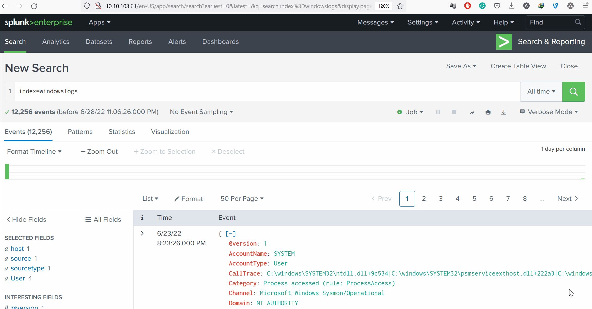<figcaption></figcaption></figure>

### Timechart

The timechart command returns the time series chart covering the field following the function mentioned. Often combined with STATS commands.

<figure>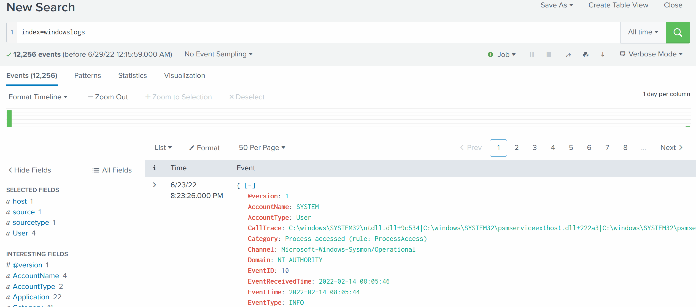<figcaption></figcaption></figure>
