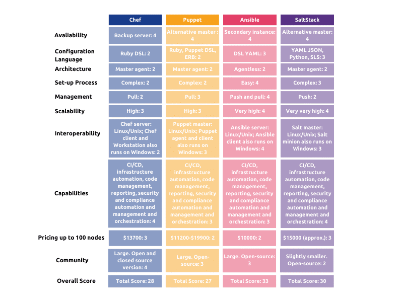

# Other Types of Deployment Servers that can be used





<figure><figcaption></figcaption></figure>

## Chef



## ( Open-Sourced kinda )Puppet



## ( Red Hat ) Ansible



## ( VMWare )SaltStack



