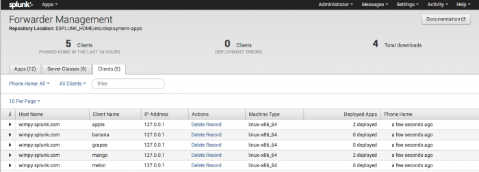

# Splunk Deployment Server

## &#x20;Deployment server&#x20;

The deployment server is just a Splunk Enterprise instance that has been configured to manage the update process across sets of other Splunk Enterprise instances. Depending on the number of instances it's deploying updates to, the deployment server instance might need to be dedicated exclusively to managing updates. For more information, read ["Plan a deployment"](http://docs.splunk.com/Documentation/Splunk/9.3.0/Updating/Planadeployment).

A Splunk Enterprise instance that acts as a centralized configuration manager, grouping together and collectively managing any number of Splunk Enterprise instances. Instances that are remotely configured by deployment servers are called [deployment clients](https://docs.splunk.com/Splexicon:Deploymentclient). The deployment server downloads updated content, such as configuration files and apps, to deployment clients. Units of such content are known as [deployment apps](https://docs.splunk.com/Splexicon:Deploymentapp).

The [forwarder management](https://docs.splunk.com/Splexicon:Forwardermanagement) interface offers an easy way to configure the deployment server.



### For more information

In _Updating Splunk Enterprise Instances_:

* [About deployment server and forwarder management](http://docs.splunk.com/Documentation/Splunk/9.3.0/Updating/Aboutdeploymentserver)
* [Deployment server architecture](http://docs.splunk.com/Documentation/Splunk/9.3.0/Updating/Deploymentserverarchitecture)

## Deploy and Use the Splunk App for Windows Infrastructure

<figure><figcaption></figcaption></figure>



## forwarder management

<figure><figcaption></figcaption></figure>

_noun_

A graphical interface built on top of the [deployment server](https://docs.splunk.com/Splexicon:Deploymentserver) that provides an easy way to configure the deployment server and monitor the status of deployment updates.

### For more information

In _Updating Splunk Enterprise Instances_:

* [About deployment server and forwarder management](http://docs.splunk.com/Documentation/Splunk/9.3.0/Updating/Aboutdeploymentserver)&#x20;

## deployment client

_noun_

A Splunk Enterprise instance that is remotely configured by a [deployment server](https://docs.splunk.com/Splexicon:Deploymentserver). Deployment clients can be grouped together into one or more [server classes](https://docs.splunk.com/Splexicon:Serverclass).

Each deployment client periodically polls its deployment server. If the deployment server has new content for the client's server class, it distributes that content to the polling client.

### For more information

In _Updating Splunk Enterprise Instances_:

* [Deployment server architecture](http://docs.splunk.com/Documentation/Splunk/9.3.0/Updating/Deploymentserverarchitecture)
* [Configure deployment clients](http://docs.splunk.com/Documentation/Splunk/9.3.0/Updating/Configuredeploymentclients)
* [Deploy apps to clients](http://docs.splunk.com/Documentation/Splunk/9.3.0/Updating/Updateconfigurations)



## Deployment Server to Push Out Apps for Data Ingestion



## Notes

1. Depending on what OS you want to install the deployment server on WINDOWS  can only work with WINDOWS agents. If you put the deployment server on a LINUX box it will be able to talk to WINDOWS and LINUX.
2. This is the same installer as the SIEM version it is just going to be configured differently. In the deployment server no log files should be routed there
3. It is free for the deployment server except for the cloud version of splunk
