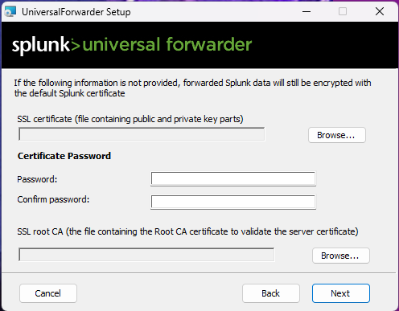
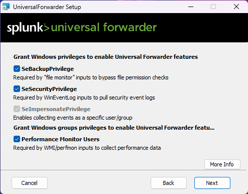
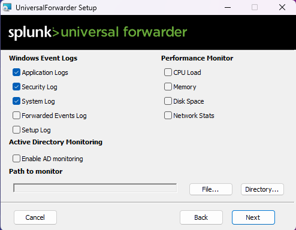
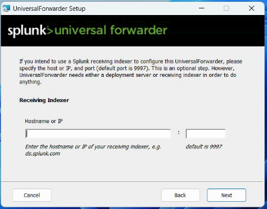

# Splunk forwarder

A Splunk forwarder is like a agent in Wazuh Siem. It is a piece of software the runs on a remote machine/client that sends data back to a central server



### Server Prep

1.  make sure the port you are using on the server to receive data is not blocked by firewall, typically it is

    1. open a firewall port in windows:&#x20;

    [https://ec.europa.eu/digital-building-blocks/sites/display/CEKB/How+to+open+a+port+on+the+firewall](https://ec.europa.eu/digital-building-blocks/sites/display/CEKB/How+to+open+a+port+on+the+firewall)
2. in splunk make sure you add a receiving port under settings > forward and receiving&#x20;
   1. click add new

<figure><figcaption></figcaption></figure>

3. add what ever port you want and click save, 9997 is the default

<figure><figcaption></figcaption></figure>

### Client Install&#x20;

1. Download the splunk forwarder. You need to have a splunk user and pass to proceed to the download link
   1.  make sure transfer or download to the client machine you want to run it



2. When starting the executable
   1. check the box to except the license
   2. &#x20;for this one we select on-prem
   3. click Customize Options

<figure><figcaption></figcaption></figure>

4. Unless you have a SSL Cert or know what it is, leave this blank&#x20;

<figure><figcaption></figcaption></figure>

5. Select virtual account

<figure><figcaption></figcaption></figure>

6. Leave all this default

<figure><figcaption></figcaption></figure>

7. Select the options you want to monitor&#x20;
   1. Performance monitors with run a lot and fill up your logs&#x20;

<figure><figcaption></figcaption></figure>

8. add a user and password&#x20;
   1. usually you would use the same one for multiple endpoints&#x20;

<figure><figcaption></figcaption></figure>

9. If you don't have a deployment server you can skip this&#x20;

<figure><figcaption></figcaption></figure>

10. this is your splunk server IP and listening port you set up in server &#x20;

<figure><figcaption></figcaption></figure>

11. install

### Troubleshooting

<figure><figcaption></figcaption></figure>

* if you see this just hit OK some times it works after that other times it will start to roll back. If it has rolled back restart the computer and try again.
* if successful you are good
