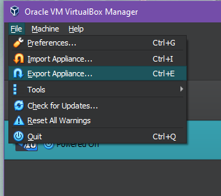
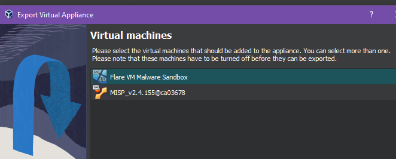
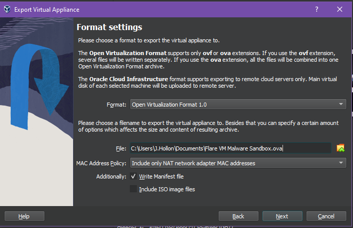

# Make A OVA file from you virtual box VM

1. Power off the virtual machine in VirtualBox. If the virtual machine is in a suspended state, power on the virtual machine and shut it down.
2. Click File > Export Appliance.

<figure><figcaption></figcaption></figure>

3. Select one or more VMs to export, and click Next.

<figure><figcaption></figcaption></figure>

4. Select a Format & provide a location to store the . ova file.

<figure><figcaption></figcaption></figure>
