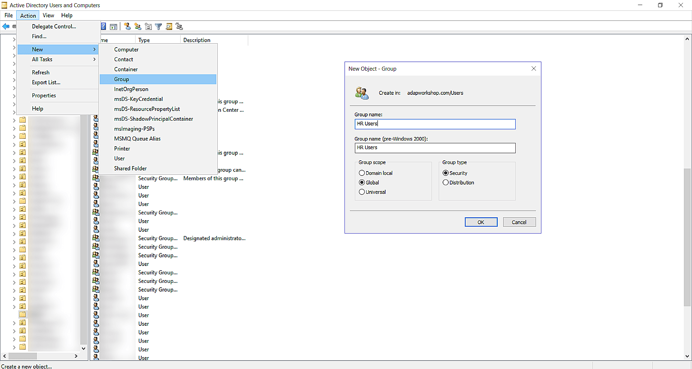
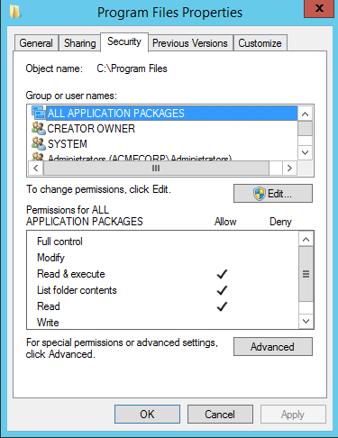
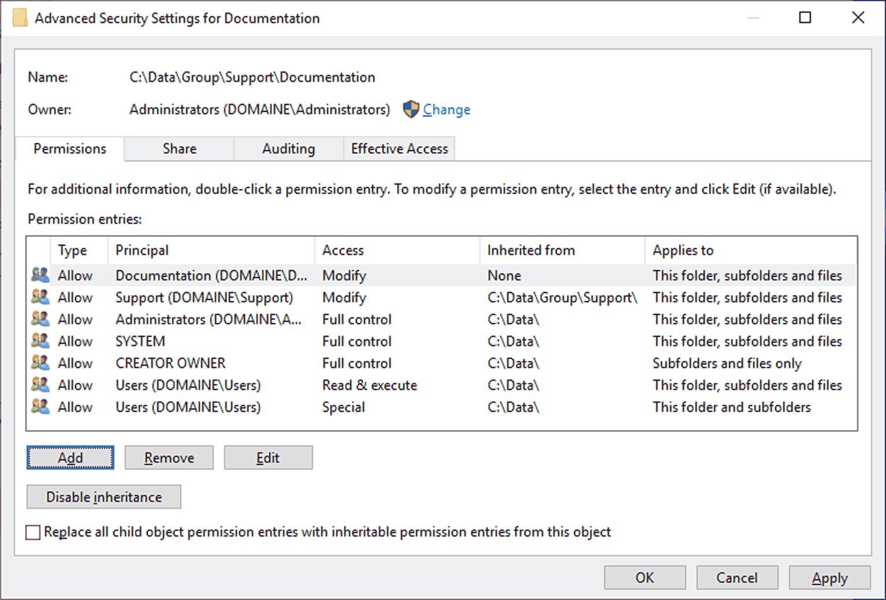
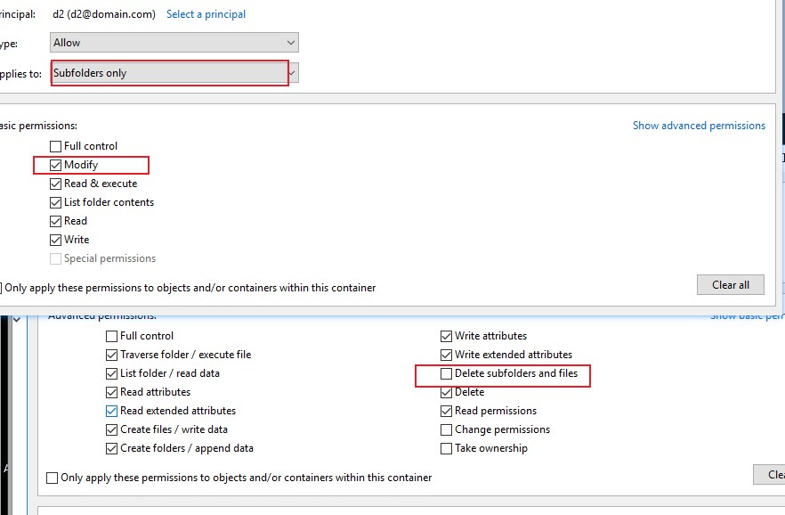

# Creating a Security Group, adding to folder and Disabling Inheritance

1. Create a Security Group with the Users in your Active Directory
   1. make sure you are in the right OU before making the security group

<figure><figcaption></figcaption></figure>

2. After you added the user got to the folder location and add Group to the security of the folder
   1. Go to properties of the file under the security tab
   2. after you hit tab find the group you just made to add

<figure><figcaption></figcaption></figure>

3. If user wants the new group created to have the only access and you see inherited groups. Under  the advanced button as you see in the above image
   1. to disable inheritance for the folder click the "Disable Inheritance" button

<figure><figcaption></figcaption></figure>

4. after the inheritance has been disabled. Go back to the Properties page and click the edit button and remove all the groups that was left over from before except the group or groups you want access.
5. Make sure you have the correct permissions to the folder you want by selecting the name of the the group and the next screen is where you will configure the permissions, then save&#x20;

<figure><figcaption></figcaption></figure>
