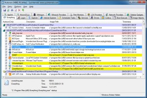

# How to uninstall a program through windows command prompt

Original Post





Let’s Download and run Microsoft **AutoRuns** utility to remove all the obsolete traces in registry for the uninstalled programs. Autoruns has the most comprehensive knowledge of auto-starting locations of any startup monitor, shows you what programs are configured to run during system bootup or login, and shows you the entries in the order Windows processes them. These programs include ones in your startup folder, Run, RunOnce, and other Registry keys.

Refer the picture below:

<figure><figcaption></figcaption></figure>

Delete all the Yellow or red entries and restart the computer and check if that helps.

**Stop a program from running automatically when Windows starts.**



**Important** _This section, method, or task contains steps that tell you how to modify the registry. However, serious problems might occur if you modify the registry incorrectly. Therefore, make sure that you follow these steps carefully. For added protection, back up the registry before you modify it. Then, you can restore the registry if a problem occurs. For more information about how to back up and restore the registry, click the following article number to view the article in the Microsoft Knowledge Base_\
[_**How to back up and restore the registry in Windows**_](http://support.microsoft.com/kb/322756/)

The entries in yellow and red are obsolete remnant of old uninstalled software, you can see the image path reads “File not found”. Right click and delete all these obsolete entries, restart the computer and check if that works.

&#x20;

If you still face issue and want to know the way how to delete a program using command prompt then try the steps provided below.

* Click on **start**.
* Type **cmd** in the search box.
* **Right click on command prompt** and select the option **run as administrator.**
* In the command prompt, type **wmic** and press Enter.
* Type **product get name** and press Enter. (see screenshot below)

**Note:** _This will give you a list of **program names** installed on your computer to use in the next step. This list will not always have all of the programs listed in **Programs and Features** though_.

* Type in either command below using the exact name of the program (ex: Microsoft Silverlight) listed in above within quotes that you want to uninstall, and press Enter.

(To be prompted Y/N to approve. Recommended) : **product where name=”name of program” call uninstall**\
\
(To NOT be prompted Y/N to approve) : **product where name=”name of program” call uninstall /nointeractive**

* If prompted, type **Y** to confirm uninstalling the program, and press Enter. (see screenshot above)
* When successfully uninstalled, you can close the command prompt.
