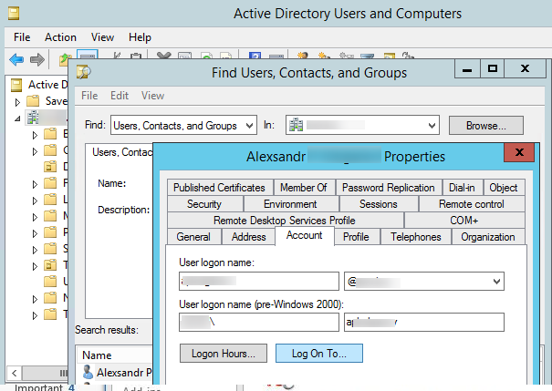
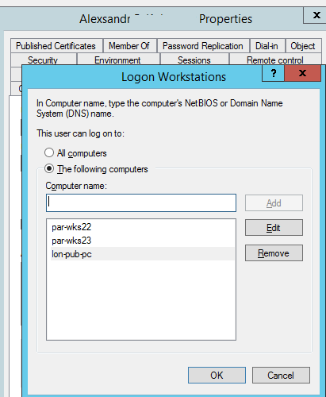
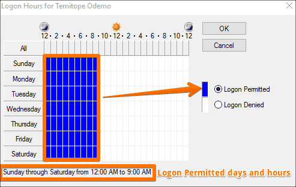

# Limit what the account can logon to an hours accessed

1. In Active Directory find a user by selecting action > find an new window will popup where you can search for users
2. once you have selected the user go into the account tab you will see two buttons "Logon hours" and "Log on to"
   1. Logon hours: select the hours a user can access computers&#x20;
   2. log on to: set the user to only be allowed to logon to a certain computer(s)

<figure><figcaption></figcaption></figure>

## Log On To Button

1. when selecting "Log on to" under computer name add the device name of the pc or whatever your naming scheme is and hit add, now user should only be able to logon that one pc

<figure><figcaption></figcaption></figure>



## Logon Hours Button

1. After clicking the logon hours button it shows you the window below
   1. All blue is logon permited
   2. All White is logon denied
2. in this image user is only allowed to sign in anyday of the week from 12am-9am and block at any other time

<figure><figcaption></figcaption></figure>


