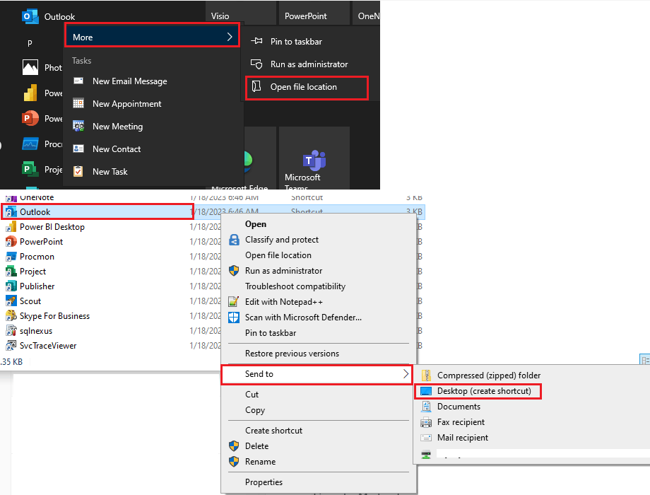

# Create a desktop shortcut for an Office program

<figure><figcaption></figcaption></figure>

1. Click the Windows key, and then browse to the Office program for which you want to create a desktop shortcut.
2. Right-click the program name or tile, and then select Open file location.
3. Right-click the program name, and then click Send To > Desktop (Create shortcut).
