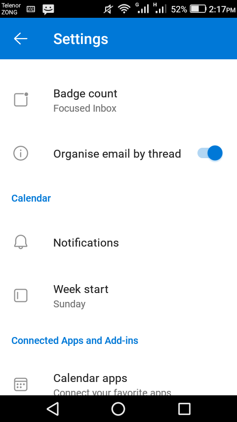

# Outlook 365 unthreading email replies



1. Click on your profile picture
2. hit the gear in the bottom left&#x20;
3. go to mail
4. then threading&#x20;
5. uncheck organize by thread

<figure><figcaption></figcaption></figure>
