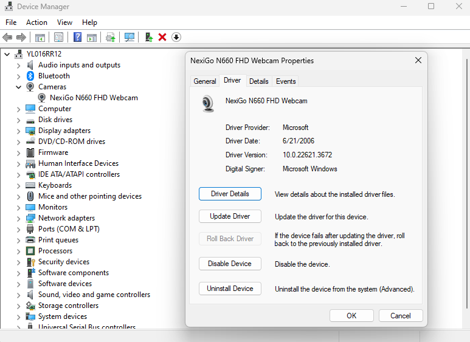

# Windows 11 camera not working Error: 0xA00F429F

When the camera is not viewing anything like the screen is black or it is black for a moment then gives you a error code. For this my error was "Error: 0xA00F429F\<WindowShowFailed>(0x887A0004)", I tried a few different ways to get it to work and the best way i found was:

In Device manager find the webcam under **cameras** drop-down an go to the second tab **drivers**. You should bee a button saying **roll back driver**. After i rolled the driver back it worked when i went into the camera app

<figure><figcaption></figcaption></figure>

### Some other useful resources that may help

Use power shell to uninstall&#x20;



Grab a windows Camera Driver

{% embed url="https://pcsupport.lenovo.com/ie/en/products/laptops-and-netbooks/ideapad-s-series-netbooks/s340-15iil/downloads/driver-list/component?name=Camera%20and%20Card%20Reader" %}

Uninstalling a windows update



