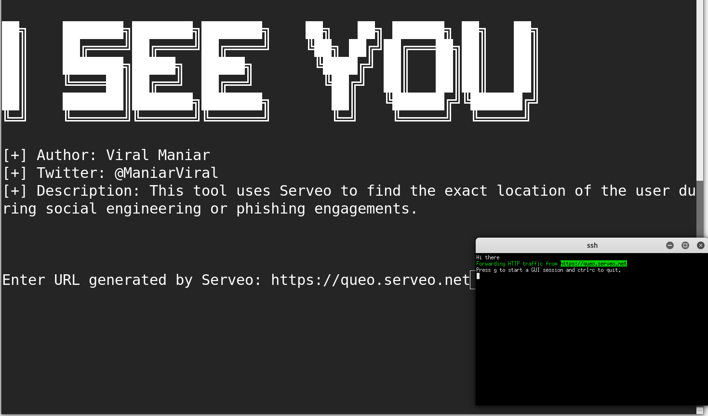
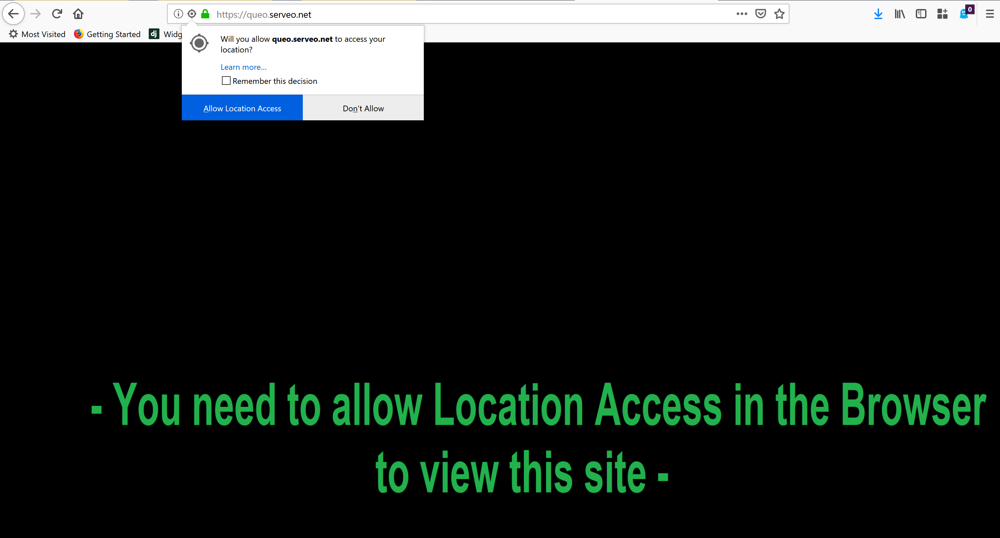
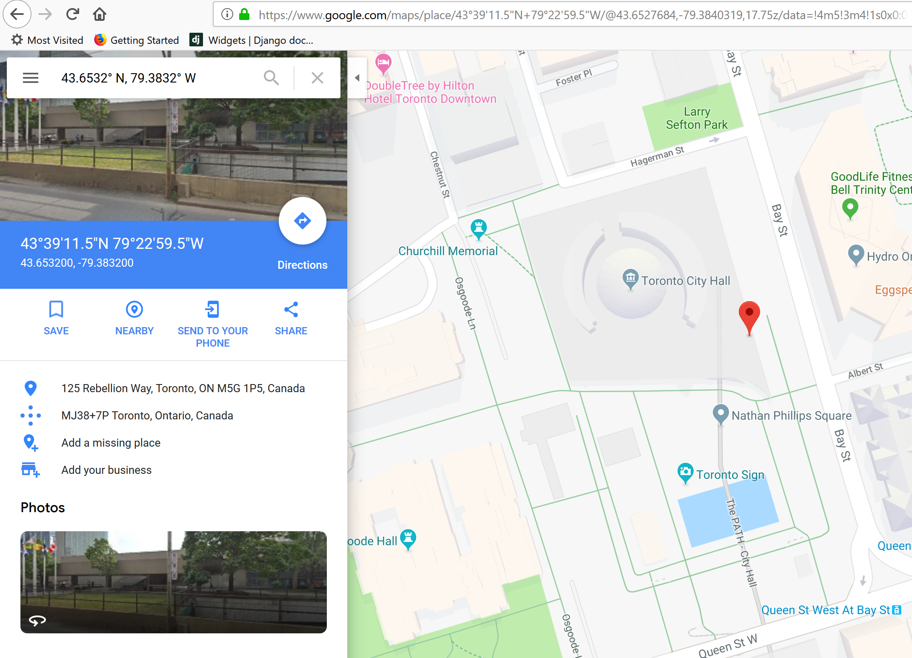

# I-See-You

<figure><figcaption></figcaption></figure>

<figure><figcaption></figcaption></figure>

<figure><figcaption></figcaption></figure>

ISeeYou is a Bash and Javascript tool to find the exact location of the users during social engineering or phishing engagements. Using exact location coordinates an attacker can perform preliminary reconnaissance which will help them in performing further targeted attacks.


