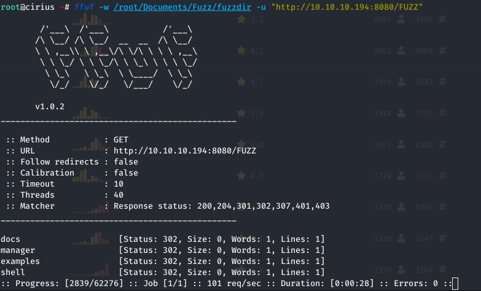

# FFUF fuzzer

<figure><figcaption></figcaption></figure>

ffuf is a fast web fuzzer written in Go that allows typical directory discovery, virtual host discovery (without DNS records) and GET and POST parameter fuzzing.

This program is useful for pen-testers, ethical hackers and forensics experts. It also can be used for security tests.

**Installed size:** `7.82 MB`\
**How to install:** `sudo apt install ffuf`

Install



Word lists


