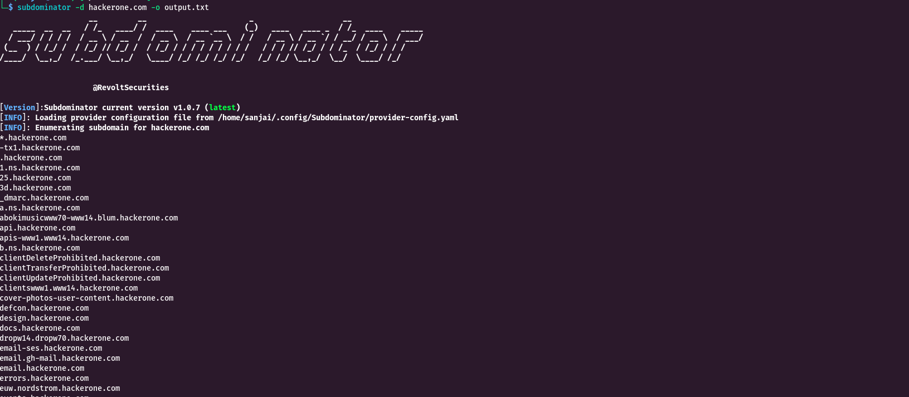

# Subdominator

<figure><figcaption></figcaption></figure>

Subdominator is a powerful tool for passive subdomain enumeration during bug hunting and reconnaissance processes. It is designed to help researchers and cybersecurity professionals discover potential security vulnerabilities by efficiently enumerating subdomains some various free passive resources.


