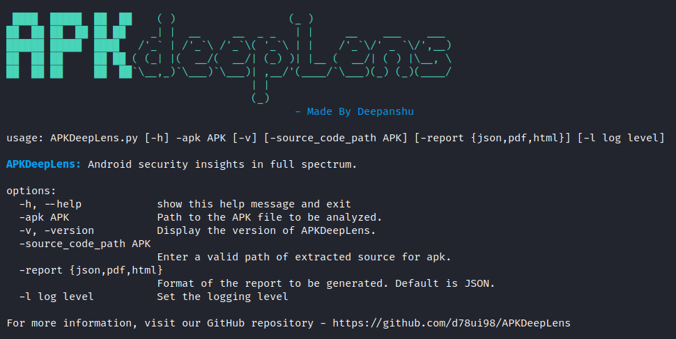

# ApkdeepLens Vuln scanner

<figure><figcaption></figcaption></figure>

APKDeepLens is a Python based tool designed to scan Android applications (APK files) for security vulnerabilities. It specifically targets the OWASP Top 10 mobile vulnerabilities, providing an easy and efficient way for developers, penetration testers, and security researchers to assess the security posture of Android apps.


