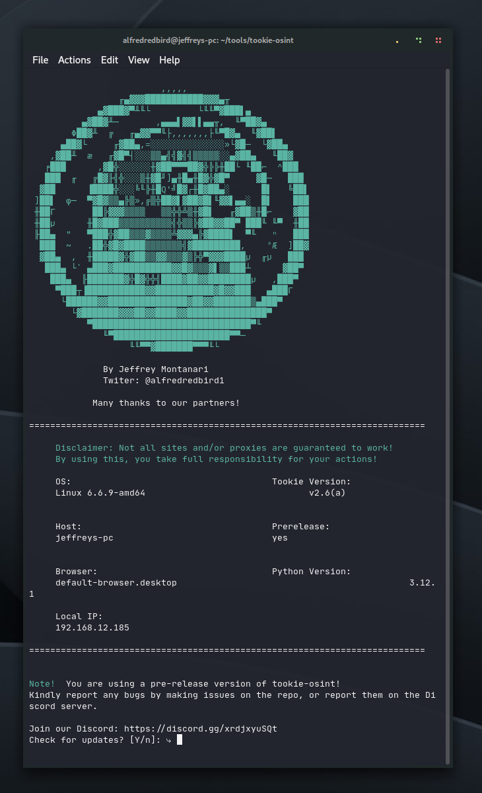

# Tookie-osint

<figure><figcaption></figcaption></figure>

Tookie-osint has a simple-to-use UI and is really straightforward. The main idea of Tookie-osint is to discover usernames that are requested from an input. Tookie-osint is similar to the tool called Sherlock. It discovers all the user accounts across different websites and Tookie-osint is successful at this task almost 80% of the time. Our tool was created by me and the community and is available for your use. I do not take responsibility for any malicious actions and/or responsibility caused by my tool. :( Please note that Tookie-osint was created to help new programmers or pentesters get into the world of OSINT.&#x20;


