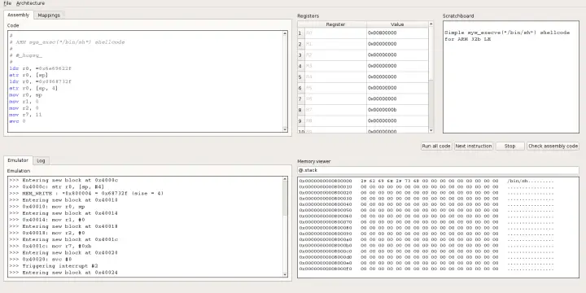

# lightweight multi-architecture assembly playground

<figure><figcaption></figcaption></figure>

Writing assembly is fun. Assembly is the lowest language (humanly understandable) available to communicate with computers, and is crucial to understand the internal mechanisms of any machine. Unfortunately, setting up an environment to write, compile and run assembly for various architectures (x86, ARM, MIPS, SPARC) has always been painful. **CEmu** is an attempt to fix this by providing GUI, CLI and [library](https://meterpreter.org/themis-open-source-high-level-cryptographic-services-library/) that allows to write and test assembly quickly.



## Install


