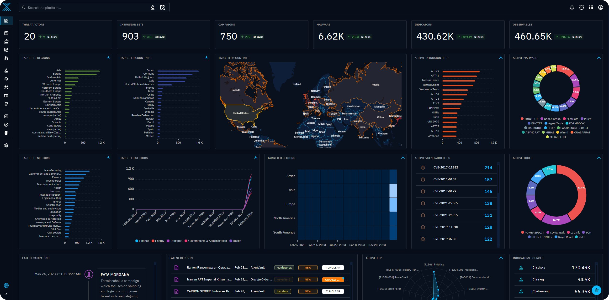

# Opencti

OpenCTI is an open source platform allowing organizations to manage their cyber threat intelligence knowledge and observables. It has been created in order to structure, store, organize and visualize technical and non-technical information about cyber threats.&#x20;

<figure><figcaption></figcaption></figure>

<figure><figcaption></figcaption></figure>

Download


