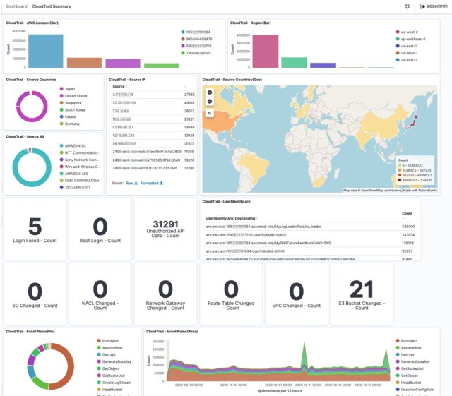

# Opensearch

The free version of Elasticsearch only supports access control for user accounts that exist in Elasticsearch. This limitation makes it hard for most companies to adopt because they are using a centralized user management system such as LDAP or OpenID.

<figure><figcaption></figcaption></figure>

OpenSearch includes access control for centralized user management, including LDAP and OpenID. With Elasticsearch, you need to pay for the premium license to get this critical feature.

Basically, the full suite of security features you will likely need are available at the Elasticsearch premium level. Whereas, you get them for free with OpenSearch.

OpenSearch is a scalable, flexible, and extensible open-source software suite for search, analytics, and observability applications licensed under Apache 2.0. Powered by Apache Lucene and driven by the OpenSearch Project community, OpenSearch offers a vendor-agnostic toolset you can use to build secure, high-performance, cost-efficient applications. Use OpenSearch as an end-to-end solution or connect it with your preferred open-source tools or partner projects.

install&#x20;



Download&#x20;


