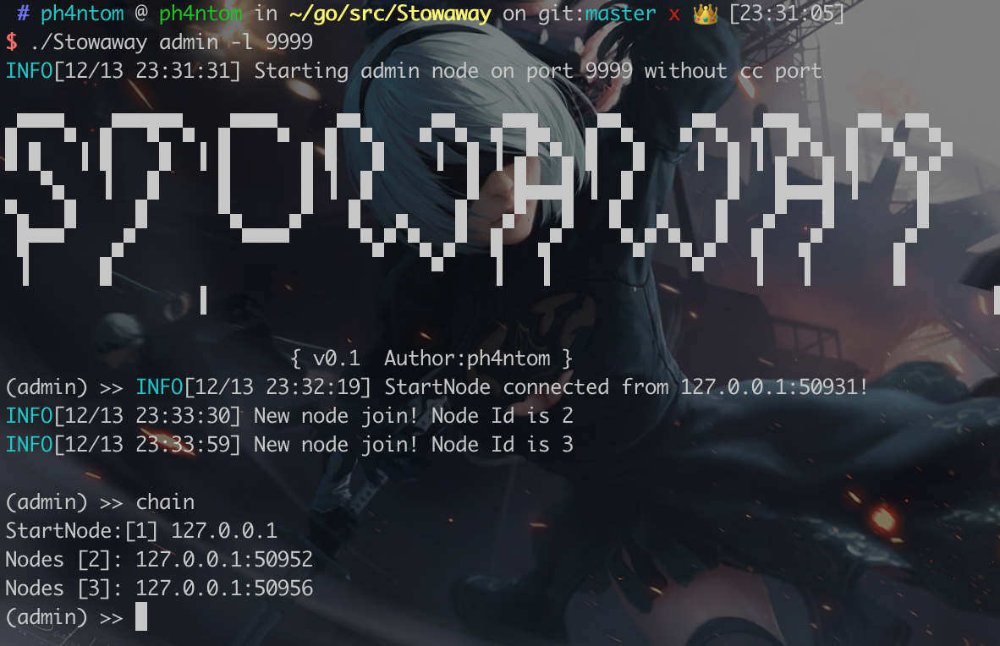

# (proxy\_reverse shell) Stowaway

<figure><figcaption></figcaption></figure>

<figure><figcaption></figcaption></figure>

Stowaway is a Multi-hop proxy tool for security researchers and pen-testers Users can easily proxy their network traffic to intranet nodes (multi-layer),break the restrction and manipulate all the nodes that under your control XD&#x20;



Download&#x20;


