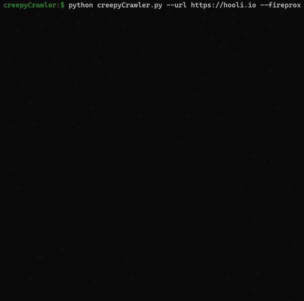

# creepyCrawler

<figure><figcaption></figcaption></figure>

OSINT tool to crawl a site and extract useful recon info.

* Provide a starting URL and automatically gather URLs to crawl via hrefs, robots.txt, and sitemap
*   Extract useful recon info:

    * Emails
    * Social media links
    * Subdomains
    * Files
    * A list of crawled site links
    * HTML comments
    * IP addresses
    * Marketing tags (UA,GTM, etc.)
    * 'Interesting' findings such as frame ancestors content and resources that return JSON content


