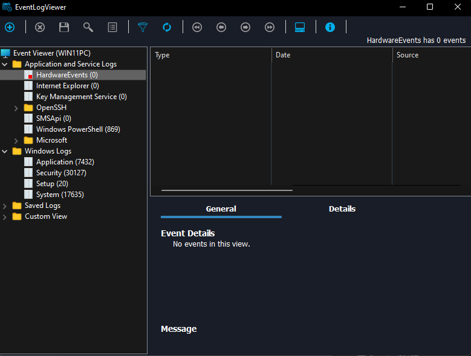

# EventLogViewer

<figure><figcaption></figcaption></figure>

EventLogViewer allows administrators and users to view the event logs on a local or remote computer EventLogViewer provides information about hardware and software events that occur on a Windows operating system. It helps network administrators track potential threats and problems. A powerful search and filter system makes it easy to find and organize data. The app offers a powerful search and filter engine for events and exports logs and data.


