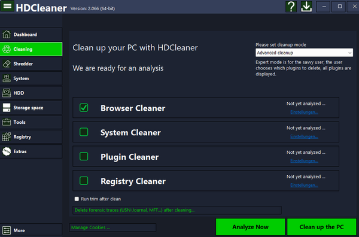

# HDCleaner

<figure><figcaption></figcaption></figure>

s your computer too slow? Over time, a large number of unwanted files and information accumulate on a PC, which not only neatly consume storage space, but also slow down the system and provide information about user behavior. HDCleaner cleans up these files and speeds up the computer in no time. Optimized for Solid-state drives (SSD) and hard disk drives (HDD).


