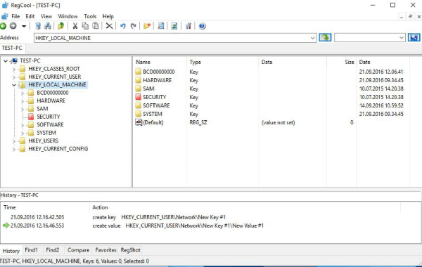

# RegCool

<figure><figcaption></figcaption></figure>

RegCool is a very flexible editor for the Windows registry. The program offers an attractive interface, convenient context menus and a handy tool bar, with the extensive editing functions are available at your fingertips. RegCool provides the complete functionality of the Windows own Regedit, but adds a lot of additions. Editing .reg and .hive-Files in Offline Mode (Offline Registry)


