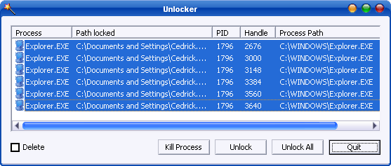

# Unlocker File Unlocker



<figure><figcaption></figcaption></figure>

Unlocker is a free application designed to help you unlock and delete files that your Windows device refuses to remove. It's also useful in killing different processes that may be causing this problem. Moreover, the program lets users delete index.


